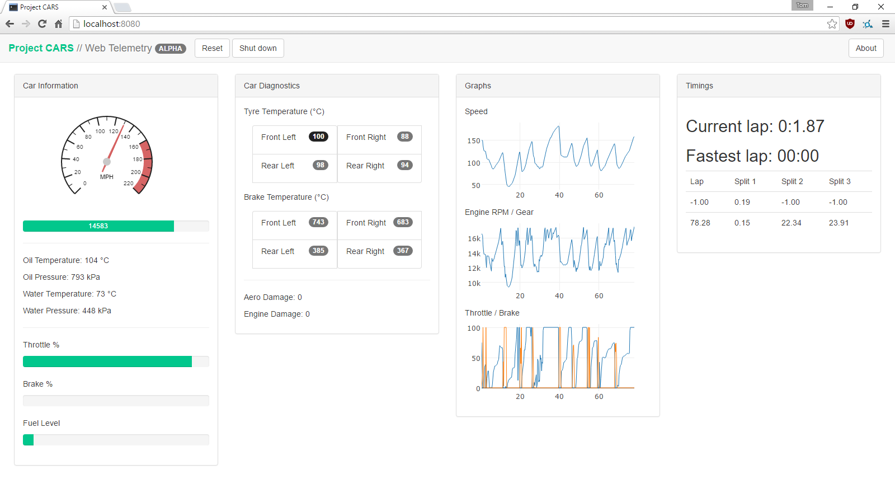
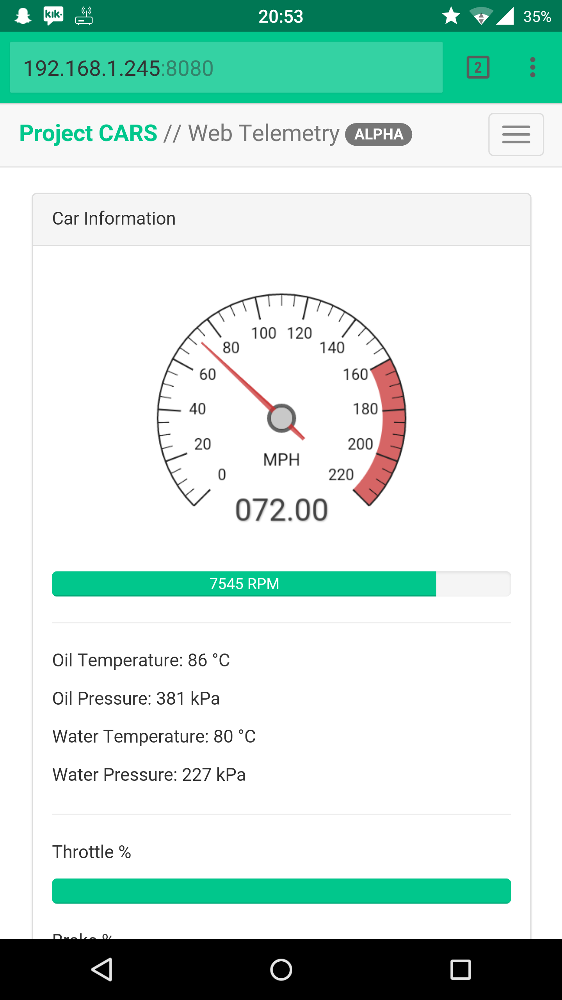

# projectcars-webapp

This is a Python/Flask web app that uses the UDP stream feature in Project CARS to provide useful telemetry and analysis.

The project relies on the library [pcars](https://github.com/jamesremuscat/pcars) from James Muscat to interpret the UDP stream.

## usage

1. Ensure you have Python 2.7 installed, as well as Flask - use `pip install flask`.
2. Download and install the pcars library from the link above - it may require some more dependencies so install as needed.
3. Download/clone this repo, `cd` into it and run `python app.py` from your terminal. If everything is installed fine you should see no errors.
4. Navigate your browser to `localhost:8080` and start using! Make sure UDP is enabled in game.

## todo

* ~~stop incomplete laps being detected (lap time = -1.00)~~
* ~~find a better way to detect when a new lap is started~~
* complete shut down method
* colour code tyre/brake temperatures
* create full (read: easy) installer

## screenshots

On desktop:

And on mobile:
